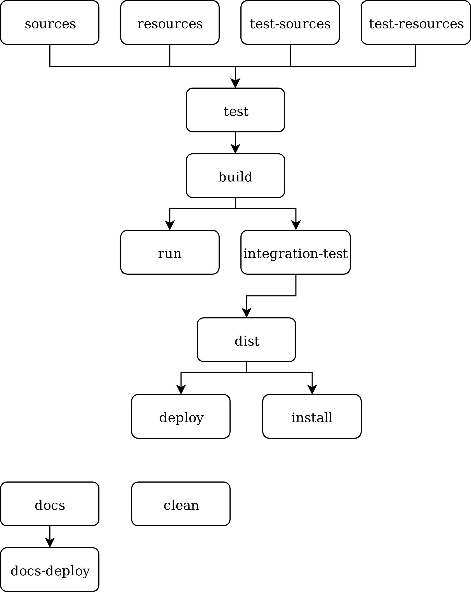

# Lifecycle

## Phases

Phases are abstract steps in build process.
Phases serves as synchronization points between plugins.
For example, C++ plugin build server application on `build` phase and docker plugin build docker-container in `dist` phase.

## Phases group

Phase group is a set of phases with dependency relations between them.
Phase group must be directed acyclic graph.

## Lifecycle

Lifecycle is a set of phases groups. 
Dogebuild provides default lifecycle that must be suitable for most of the projects.

## Default lifecycle

Dogebuild defines default lifecycle which consists from three phases group:
 - Build - build project and perform distribution actions
 - Docs - build project documentation
 - Clean - clean all working data

Default lifecycle schema:



## Use custom lifecycle

To use custom lifecycle call `lifecycle` function in `dogefile.py` before plugins initialization with phases dictionary.
You must enumerate all the phases as keys o this dictionary and values are lists of dependency of each phase.


```python
from dogebuild.context import lifecycle


lifecycle({
    'clean': [],
    'docs': [],
    'docs-deploy': ['docs'],
    'sources': [],
    'resources': [],
    'test-sources': [],
    'test-resources': [],
    'test': ['sources', 'resources', 'test-sources', 'test-resources'],
    'build': ['test'],
    'run': ['build'],
    'integration-test': ['build'],
    'dist': ['integration-test'],
    'deploy': ['dist'],
    'install': ['dist'],
})

```

